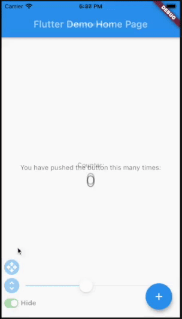
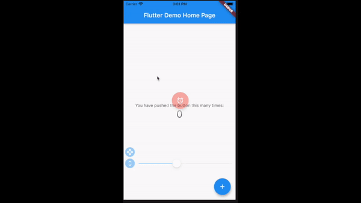

# pixel_perfect

[](https://pub.dartlang.org/packages/pixel_perfect)
[](https://opensource.org/licenses/MIT)
[](https://pub.dev/packages/effective_dart)
[](https://github.com/kherel/pixel_perfect)

Put a semi-transparent image with the design over the top of the developed layout. It helps you to compare original design and current page.




## Getting started

Add pixel_perfect in your `pubspec.yaml` dependencies.

```yaml
dependencies:
 pixel_perfect: any
```

### How To Use

**Simple use**

Add assets folder with images to your `pubspec.yaml`

```yaml
  uses-material-design: true
  assets:
    - assets/
```

Import the following package in your dart file

```dart
import 'package:pixel_perfect/pixel_perfect.dart';
```

```dart

return PixelPerfect(
  assetPath: 'assets/design.png', // path to your asset image
  child: Scaffold(
    ..
  )
)
```

**Extended use**

```dart

return PixelPerfect.extended(
  image: Image.asset( // any image file
    'assets/element.png',
    scale: 2,
  ), 
  initBottom: 20, //  default bottom distance (optional)
  offset: Offset.zero, // default image offset (optional)
  child: Scaffold(
    ..
  )
)
```