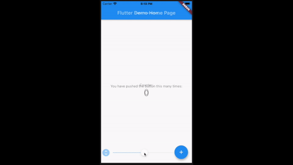

# pixel_perfect

Add semi transparent image to your screen.



## Getting started

Add animated_theme_switcher in your `pubspec.yaml` dependencies.

```yaml
dependencies:
 pixel_perfect: any
```

### How To Use

Add assets folder with images to your `pubspec.yaml`

```yaml
  uses-material-design: true
  assets:
    - assets/
```

Import the following package in your dart file

```dart
import 'package:pixel_perfect/pixel_perfect.dart';
```

```dart
  return PixelPerfect(
    image: 'assets/design.png', // path to your asset image
    offset: Offset(0, 0)  // optional argument if you need to move image
    child: Scaffold()
  )
```